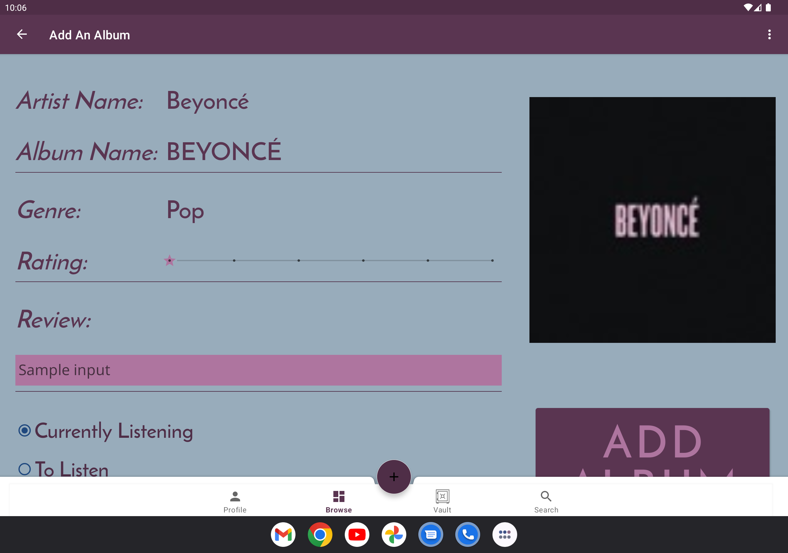

# Welcome to Vinyl Vault

## Description
Vinyl Vault is the ultimate companion app for music enthusiasts alike.
You can catalogue any album you’ve listened to or are currently enjoying, providing a comprehensive overview of your musical journey. Keep tabs on your favourite artists & genres, and discover hidden gems. Vinyl Vault will also create a wishlist of albums you wish to explore next!

The profile page menu allows you to view your top albums and genres, as well as snap a screenshot to share with your friends. Vinyl Vault strives to be a personal app. There’s no comparison against other members because listening to music shouldn’t be a competition!

Your Vault allows you to store albums you’ve listened to, ones you want to listen to, and any you’re currently listening to. Each album displays some simple information about it, including the artist, genre, and tracklist. And after logging an album, you can add a star rating and a written review. So, when you and your fellow music-lover friends are talking about your favourite albums, you can be sure to share your review that was written in real time!

## Getting Started Guide
Download the project [here](https://github.com/sierrariley/VinylVault.git).

## Prerequisites
To run Vinyl Vault, you'll need:

- Android Studio installed on your computer
- An Android device or emulator running Android 5.0 (Lollipop) or higher

## Screenshots

<table>
<td></td>
<td></td>
<td></td>
</table>
<table>
<td></td>
<td></td>
<td></td>
</table>

## Database Schema

## Compatibility
Vinyl Vault is compatible with a wide range of Android devices, including smartphones and tablets. It has been tested on various screen sizes and resolutions to ensure a seamless user experience across different devices.

## Authors
- Sage Lawrence : [@sagelawrence04](https://github.com/sagelawrence04)
- Sierra Riley : [@sierrariley](https://github.com/sierrariley)

## License
Copyright 2024 - All Rights Reserved

## Credits
- All Albums generates through [iTunes API](https://developer.apple.com/documentation/applemusicapi/)
- Images uploaded with [Picasso](https://square.github.io/picasso/)
- App logo created with [Canva](https://www.canva.com/)

